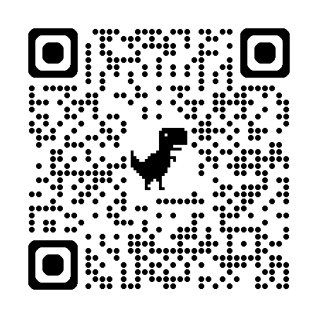

<!-- Google tag (gtag.js) -->

<!-- _paginate: false -->

# 可複製的好課：教學的系統思考

 
 

## Denny Huang
### 2025/09/17 @陽明交通大學 軟體開發社

---

# [https://denny.one/20250917-NYCU-SDC](https://denny.one/20250917-NYCU-SDC)

---

# Denny Huang

- <a href="https://sitcon.org/" target="_blank">SITCON 學生計算機年會</a> 共同發起人
- <a href="https://denny.one/" target="_blank">About me</a>

---

# 教學經驗？

---

# 預錄影片/現場教學差異？

---

# 魔術教學起家

---

# 目標
- 演出成份多少？
- 聽眾能帶走多少？
- 實做內容要完成到哪？

---

# 聽眾
- 他來到這裡的目的
- [自我決定論](https://zh.wikipedia.org/zh-tw/%E8%87%AA%E6%88%91%E6%B1%BA%E5%AE%9A%E8%AB%96)
- 能力與程度
- 文化及教育背景
- 年齡區間
- 情緒/氛圍
- 安全感

---

# 場地
- 投影設備
- 擴音設備
- 燈光
- 座位安排
  - 講者/聽眾位置
  - 分組安排與否
  - 巡場難易度
- 人數
- 網路/插座
- 白板/便條/筆/其他教具

---

# 工作坊
- 操作環境
- 助教人數
- 助教分工
- 注意自己的肌肉記憶，新手可能很陌生
- 風險與備案

---

# 教案
- 目標
- 檢核點
- 挫敗點
  - 審慎使用小心安排
- 時間控制

---

# 用字遣詞
- 符合聽眾文化背景及認知
  - 請 AI 用...聽得懂的方式解釋
- 妥善使用專有名詞
- 避免歧義/代名詞
- 避免負面詞彙

---

# 互動及觀察
- 眼神
- 表情
- 肢體語言
- 學習狀況

---

# 互動技巧
- 封閉式提問
  - 是/否
  - 一翻兩瞪眼的問題
  - 易於回饋/建立安全感
- 正面提問
  - 好的人舉手/還沒有跟上的舉手

---

# 事後追蹤/評量
- 回饋問卷
- 連續性課程，後續應完成進度

---

# [Gagne’s 9 Events of Instruction](https://isu.pressbooks.pub/thuff/chapter/gagnes-9-events-of-instruction-nick-lambertsen/)
- 引起注意（Gain attention）
- 告知目標（Inform learner of objectives）
- 提示回憶原有知識（Stimulate recall of prior learning）
- 呈現教材（Present stimulus material）
- 提供學習指導（Provide learner guidance）
- 引出作業（Elicit performance）
- 提供回饋（Provide feedback）
- 評估作業（Assess performance）
- 促進保持與遷移（Enhance retention transfer）

---

# Q&A

---

# Thanks for listening

 
 

###### 本投影片採用
 <a href="https://creativecommons.org/licenses/by-sa/4.0/deed.zh-hant" target="_blank">創用 CC「姓名標示-相同方式分享 4.0 國際」授權條款</a>釋出
 <a href="https://marp.app/" target="_blank">Marp</a> 製作
